# Time to Answer

## Sobre
O projeto **Time to Answer** é um site de perguntas e respostas desenvolvido durante o curso [**Ruby on Rails 5.x - Do início ao fim!**](https://www.udemy.com/course/rubyonrails-5x/) do Jackson Pires com o intuito de colocarmos em prática todo conteúdo estudado durante o curso.

## Algumas tecnologias utilizadas
- [Ruby](https://www.ruby-lang.org/pt/) (2.7.8)
- [Rails](https://rubyonrails.org/) (6.1.7.6)
- HTML
- CSS
- JavaScript

## Algumas ferramentas utilizadas
- [Devise](https://github.com/heartcombo/devise) para autenticação
- [Rails-I18n](https://github.com/svenfuchs/rails-i18n) para internacionalização
- [Kaminari](https://github.com/kaminari/kaminari) para paginação

## Instruções para uso
Clone o projeto em sua máquina e instale as dependências do projeto com os comandos:
```bash
bundle
yarn
```

Logo após, crie o banco de dados com:
```bash
rails db:create
rails db:migrate
```

Para inicializar o banco de dados com dados, rode:
```bash
rails dev:setup
```

Levante e rode a aplicação com:
```bash
rails s
```
E, finalmente, acesse ```http://localhost:3000``` no seu navegador.

---

## Telas do Projeto

### Página inicial
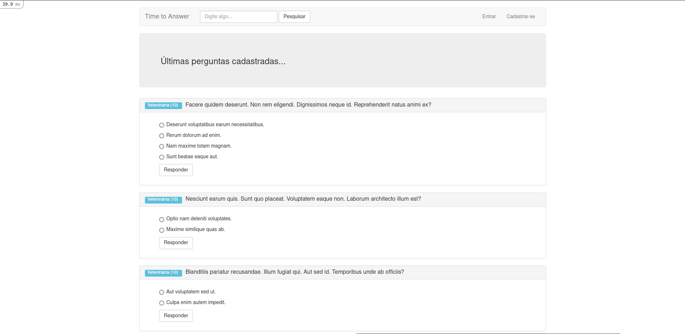

### Busca por área
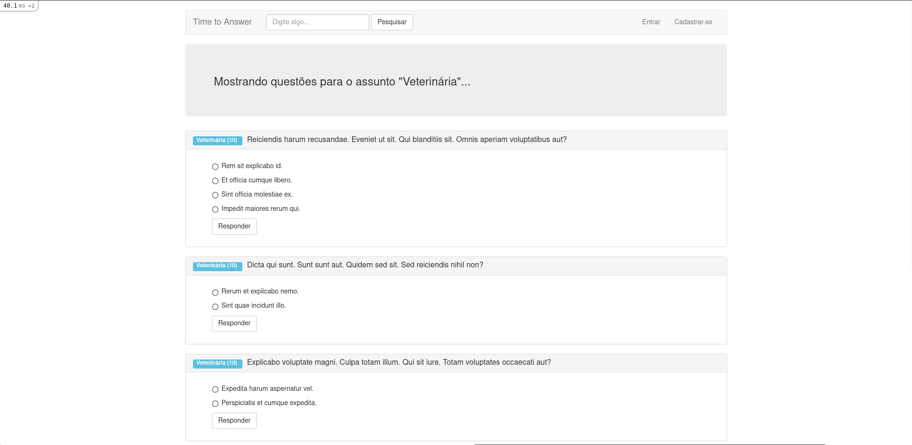

### Busca por termo
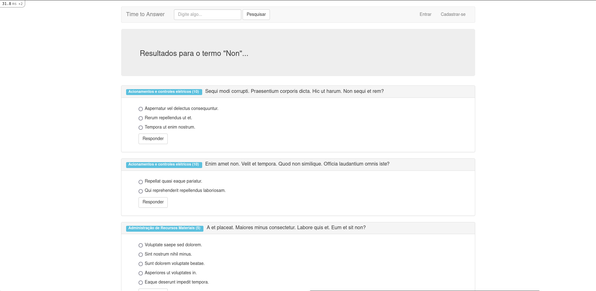

### Login
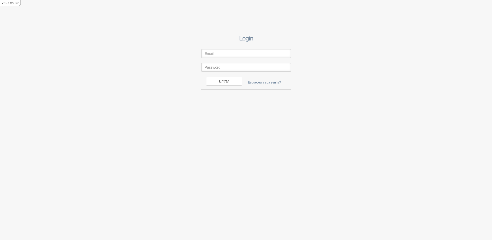

### Esqueceu a senha
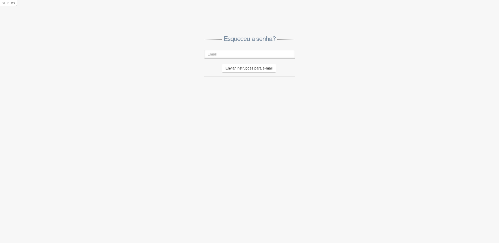

### Cadastro de usuário
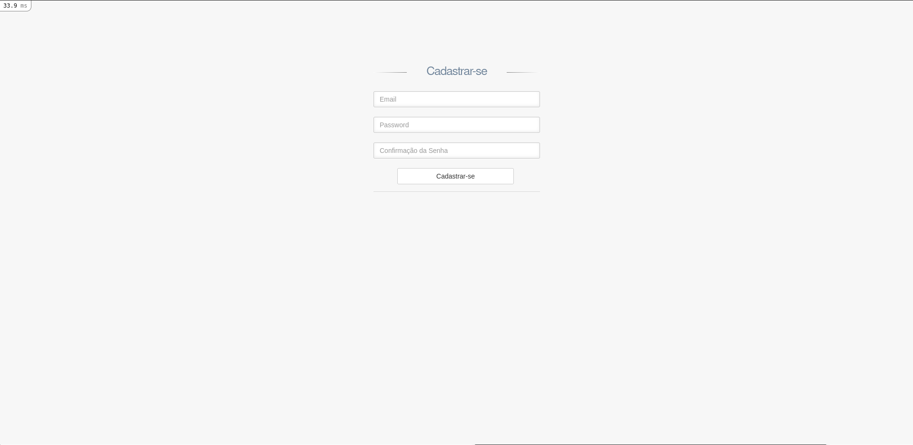

---

## Área do Usuário

### Página inicial do usuário
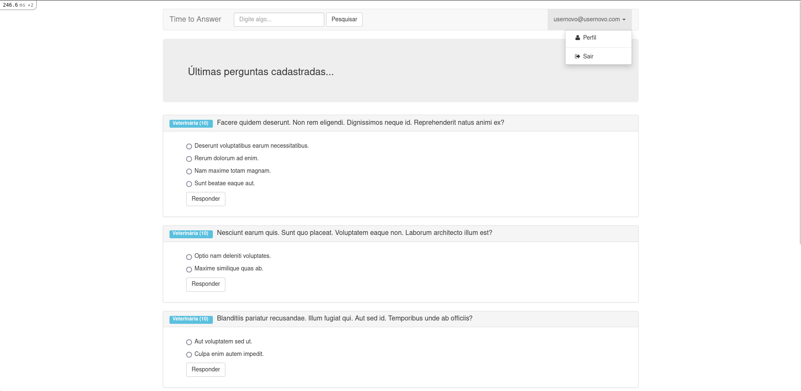

### Perfil do usuário
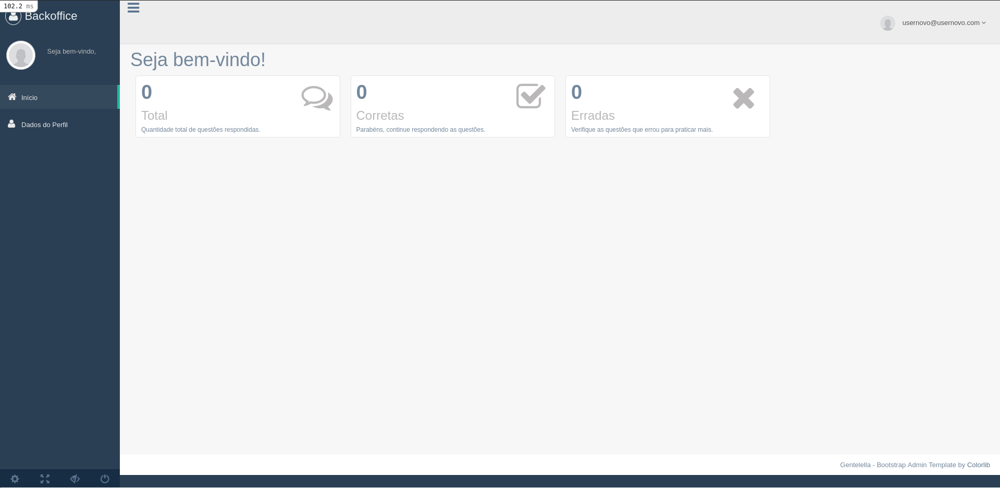

### Editar perfil
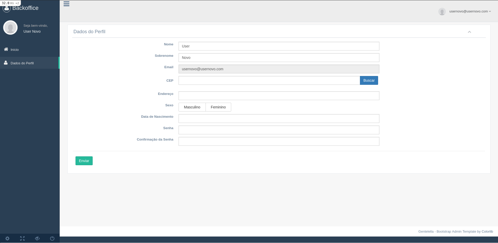

### Editar foto do perfil
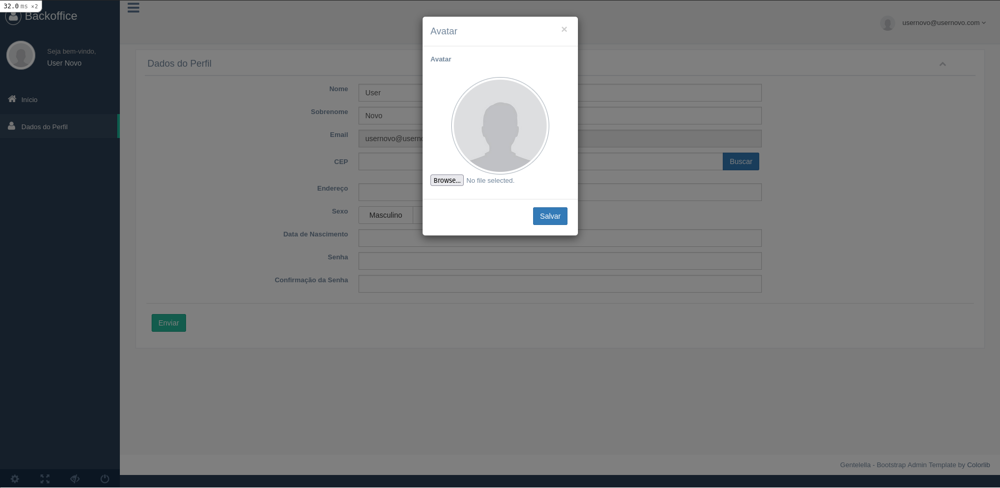

### Editar nome do usuário


### Página inicial do usuário - Respondendo perguntas
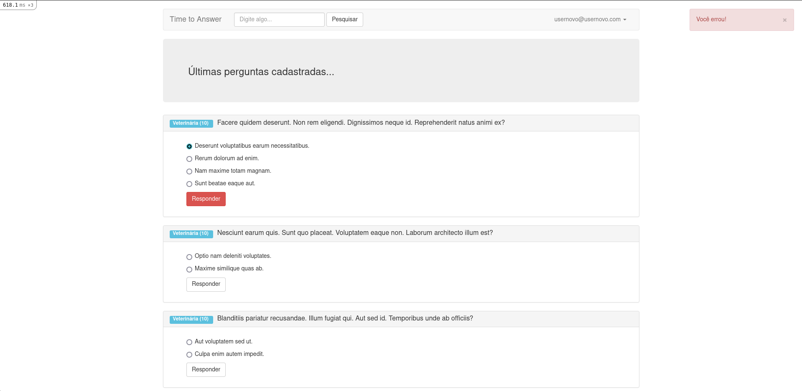

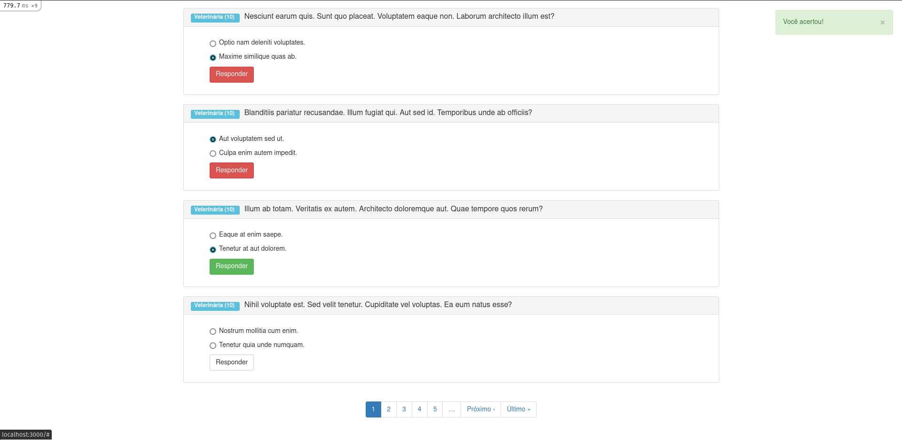

### Perfil do usuário - Respostas
